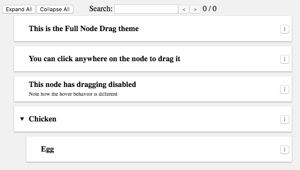

# Minimal React Sortable Tree Theme


## Features
* Minimalistic Theme for React Sortable Tree

## Usage

```sh
npm install --save react-sortable-tree-theme-minimal
```

```jsx
import React, { Component } from 'react';
import SortableTree from 'react-sortable-tree';
import MinimalTheme from 'react-sortable-tree-theme-minimal';

export default class Tree extends Component {
  constructor(props) {
    super(props);

    this.state = {
      treeData: [{ title: 'src/', children: [ { title: 'index.js' } ] }],
    };
  }

  render() {
    return (
      <div style={{ height: 400 }}>
        <SortableTree
          treeData={this.state.treeData}
          onChange={treeData => this.setState({ treeData })}
          theme={MinimalTheme}
        />
      </div>
    );
  }
}
```
